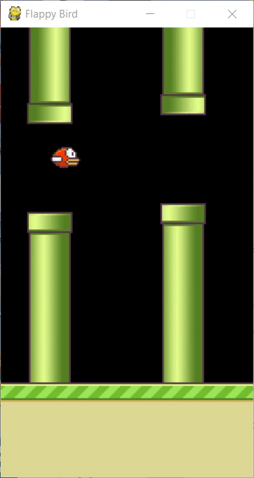
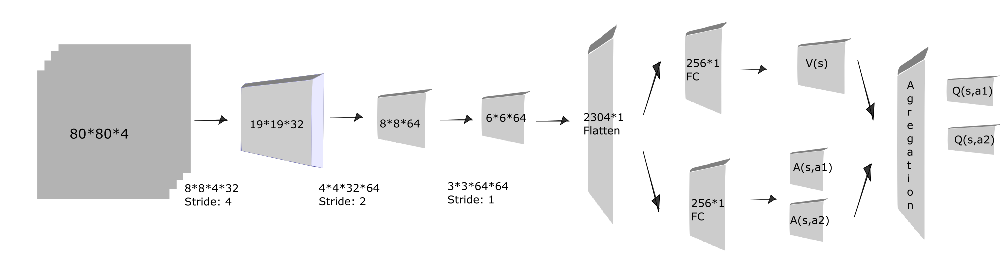

# Deep Q Learning with Flappy Bird


## Overview
Although the Deep Q Learning method is commonly used in solving Atari games, there have not been many implementations of advanced techniques such as Prioritized Experience Replay and Freezing Target Network. This project implements these techniques using appropriate data structures and explores their effectiveness.

## Installation Dependencies:
* Python 3
* TensorFlow 2
* pygame
* OpenCV-Python

## Testing:

from FlappyBird/models extract model.ckpt.rar

python deep_flappy.py

## Training:

deep_flappy.py line 90 

change training = False to training = True

python deep_flappy.py

## What is Double Dueling Deep Q-Network?
It is a variant of the Deep Q-learning network. The Double DQN uses two systems, Q and Q'(target network), to determine action and value, respectively. In doing so, it prevents overestimation. 

The Dueling DQN uses two streams after the convolution layers, namely V(s) and A(s, a). Q(s, a) is the aggregation of V(s) and the normalized A(s, a). This change in network structure makes updates of Q values of the state, action pair more efficient (we can only sample so much data). 

## Network Architecture


#### please imagine the depth :D

## Implementetion Tips

#### Image Preprocessing
1. Convert image to grayscale
2. Resize the image to 80x80
3. normalize pixels

#### Stacked Frames
Stacking the consecutive frames gives a sense of motion to the network (i.e., is the bird moving up or down?). Note that the term "consecutive" here is not strictly correct. The Deep Mind group uses a skipping frame parameter, also set at 4.

#### Prioritized Experience Replay
In short, the data with the larger TD error in previous training has a higher probability of being sampled from the experience buffer. This technique is implemented using SumTree. The SumTree code is modified version of [MorvanZhou/Reinforcement-learning-with-tensorflow] https://github.com/MorvanZhou/Reinforcement-learning-with-tensorflow/blob/master/contents/5.2_Prioritized_Replay_DQN/RL_brain.py

#### Freezing Target Network
In practice, both Q and Q' updates simultaneously. To stabilize training, I update the Target Network every Tau step.

#### Pooling Layer
Note that I did not use any pooling layer in the network structure, unlike in image recognition tasks. This is because the pooling layer might destroy the information about objects' positions.

#### Explore Policy
Normally the random step is to pick an action at random. However, the bird agent runs in 30 FPS and 1 APF (Action per Frame), which means a 50% chance of flapping results in the bird continuously flying into the ceiling. Here I used a 90% chance for falling and a 10% chance for flapping.

## Further Implementations

* Multi-Step

* Noisy Net

* Distributional Q-function

## Deep Q-Network Algorithm

The pseudo-code for the Deep Q Learning algorithm, as given in [1], can be found below:

```
Initialize the weights for DQN
Initialize target value weights w- <- w
Init the environment
Initialize the decay rate (that will use to reduce epsilon)

For an episode to max_episode do

  Make a new episode
  Set step to 0
  Observe the first state $s_0$

  While step < max_steps do:

    Increase decay_rate
    With $\epsilon$ select a random action $a_t$, otherwise select $a_t = \mathrm{argmax}_a Q(s_t,a)$
    Execute action $a_t$ in simulator and observe reward $r_{t+1}$ and new state $s_{t+1}$
    Store transition $

    Sample random mini-batch from $D$: $$

    Set target $\hat{Q} = r$ if the episode ends at $+1$, otherwise set $\hat{Q} = r + \gamma Q(s',argmax_{a'}{Q(s', a', w), w^-)}$
    Make a gradient descent step with loss $(\hat{Q} - Q(s, a))^2$
    Every C steps, reset: $w^- \leftarrow w$
  endfor

endfor
```  

## References

[1] Mnih Volodymyr, Koray Kavukcuoglu, David Silver, Andrei A. Rusu, Joel Veness, Marc G. Bellemare, Alex Graves, Martin Riedmiller, Andreas K. Fidjeland, Georg Ostrovski, Stig Petersen, Charles Beattie, Amir Sadik, Ioannis Antonoglou, Helen King, Dharshan Kumaran, Daan Wierstra, Shane Legg, and Demis Hassabis. **Human-level Control through Deep Reinforcement Learning**. Nature, 529-33, 2015.

## Acknowledgement
This work is highly based on the following repos:

1. [sourabhv/FlapPyBird] (https://github.com/sourabhv/FlapPyBird)
2.  [simoninithomas/Deep_reinforcement_learning_Course] https://github.com/simoninithomas/Deep_reinforcement_learning_Course/blob/master/Deep%20Q%20Learning/Doom/Deep%20Q%20learning%20with%20Doom.ipynb
